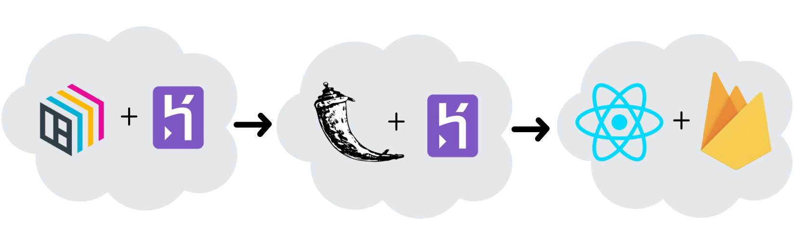

# Fellowship Prediction
## GitHub Profile Comparative Analysis Tool Built with BentoML

Table of Contents:
* [Features](#features)
* [Disclaimer](#disclaimer)
* [Technologies Used](#technologies-used)
* [Contributing](#contributing)
* [Demo](#)
* [Motivation](#)
* [Team](#)
* [License](#license)

## Features

**Analyzes your GitHub Profile and presents you with a report on how likely you are to become the next MLH Fellow!**

Provides you with an **extensive analysis** on the following features of your profile:

| Feature | Description |
| :---- | :---- |
| Commits | Number of total commits the user made |
| Contributions | Number of repositories where the user made contributions |
| Followers | Number of followers the user has |
| Forks | Number of forks the user has in their repositories |
| Issues | Number of issues the user has raised |
| Organizations | Number of organizations the user is a part of |
| Repos |  Number of repositories the user has |
| Stars | Number of stars the user has on their repositories |

And gives you a comprehensive score of how similar your GitHub Profile is to an **average MLH Fellow's GitHub**.

It also shows your statistics in a **user-friendly data visualization** format for you to **gauge the range of your skills**
and **become the next MLH Fellow!**

## Disclaimer

## Technologies Used

We used the following technologies:
* **BentoML** along with **Heroku** to build an API endpoint that calculates the comprehensive score for the user based on a simple query.
* **Flask** deployed to **Heroku** to setup a bridge between the frameworks and collect the input data.
* **React.js** served on **Firebase** to provide user-friendly UI for future MLH fellows to use.

## Contributing

To contribute to this open-source project, follow these steps:

1. Fork the repository.
2. Create a branch: `git checkout -b <branch_name>`.
3. Make your changes and commit them: `git commit -m '<commit_message>'`.
4. Push to your branch: `git push origin <project_name>/<location>`.
5. Create a pull request.

To work on BentoML:
1. Go to [_model/bento_deploy_](https://github.com/dtemir/fellowship-prediction/tree/main/model/bento_deploy) to find necessary files.
2. Read [BentoML Start Guide](https://docs.bentoml.org/en/latest/quickstart.html) to learn more about the files.
3. Improve the BentoML Interface to provide our users with a more accurate score.
4. Create the BentoML prediction service with `python bento_packer.py` and commit the saved class from `bentoml get IrisClassifier:latest --print-location --quiet`.

_Alternatively:_ Reach out to one of the [Project Contributors](https://github.com/dtemir/fellowship-prediction/graphs/contributors) for questions.

## Demo

Placeholder for our Demo Video

## Motivation

What made us go for it 

## Team

<table>
  <tr>
    <td align="center"><a href="https://github.com/dtemir"> <b>Damir Tamir</b></a> </td>
 <td align="center"><a href="https://github.com/bennaaym"> <b>Aymen Bennabi</b></a> </td>
 <td align="center"><a href="https://github.com/tashakim"> <b>Tasha Kim</b></a> </td>
 <td align="center"><a href="https://github.com/mofe64"> <b>Eyimofe Ogunbiy</b></a> </td>
  </tr>
</table>

### Damir Temir - [@dtemir](https://github.com/dtemir)

 

 

### Aymen Bennabi - [@bennaaym](https://github.com/bennaaym)

 

 

### Tasha Kim - [@tashakim](https://github.com/tashakim)

 

 

### Eyimofe Ogunbiyi - [@mofe64](https://github.com/mofe64)

 

 

## License

This project is served under the MIT License.

MIT License

Copyright (c) 2021 Damir Temir

Permission is hereby granted, free of charge, to any person obtaining a copy
of this software and associated documentation files (the "Software"), to deal
in the Software without restriction, including without limitation the rights
to use, copy, modify, merge, publish, distribute, sublicense, and/or sell
copies of the Software, and to permit persons to whom the Software is
furnished to do so, subject to the following conditions:

The above copyright notice and this permission notice shall be included in all
copies or substantial portions of the Software.

THE SOFTWARE IS PROVIDED "AS IS", WITHOUT WARRANTY OF ANY KIND, EXPRESS OR
IMPLIED, INCLUDING BUT NOT LIMITED TO THE WARRANTIES OF MERCHANTABILITY,
FITNESS FOR A PARTICULAR PURPOSE AND NONINFRINGEMENT. IN NO EVENT SHALL THE
AUTHORS OR COPYRIGHT HOLDERS BE LIABLE FOR ANY CLAIM, DAMAGES OR OTHER
LIABILITY, WHETHER IN AN ACTION OF CONTRACT, TORT OR OTHERWISE, ARISING FROM,
OUT OF OR IN CONNECTION WITH THE SOFTWARE OR THE USE OR OTHER DEALINGS IN THE
SOFTWARE.

